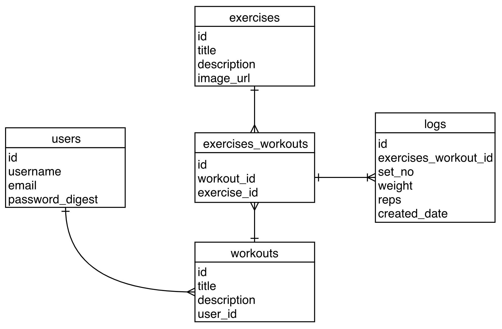

# Workout Mate

Workout Mate is an app that allows you to Discover, create & log your workouts.

It was built during General Assembly's Web Development Immersive course as part of project 2, which challenged us to build a Sinatra based CRUD application of our choice.

The app is available on [Heroku](https://limitless-hollows-97939.herokuapp.com/)

## How to use Workout Mate

1. Signup using a name, email address and password.
1. Create workout routines by selecting from a list of exercises.
1. Log a session against a workout.

## Technologies Used

* Ruby
* Sinatra
* HTML
* CSS
* PostgreSQL
* ActiveRecord
* brypt

## Data Model

Workout Mate's resources are _Users_, _Workouts_, _Exercises_, _Logs_ and _Exercise / Workout Relationships_ that are connected as follows:

## Development Status

Workout Mate's current status is at MVP. All resources are connected and CRUD operations can be performed, but there are various open requirements to be satisfied:

* The home / index page currently requires that workouts have logs attached to them; if they don't the page crashes.
* It is possible to log out and then navigate back via the browser; i.e. authentication is not completely enforced across the page, only when making put, post and delete requests.
* Workouts cannot be copied from one user to another yet.
* Logs can only be submitted for one set, however the aim is that multiple sets can be saved in one go
* Misc.
